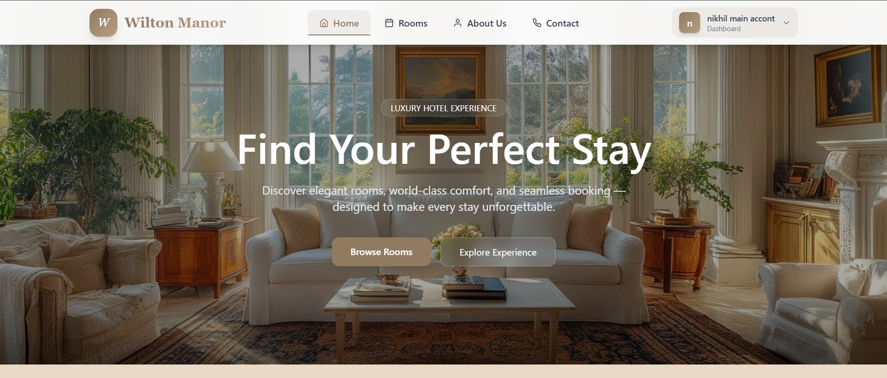
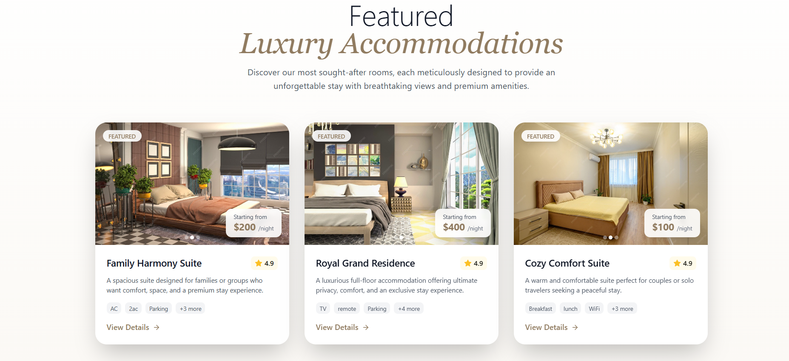
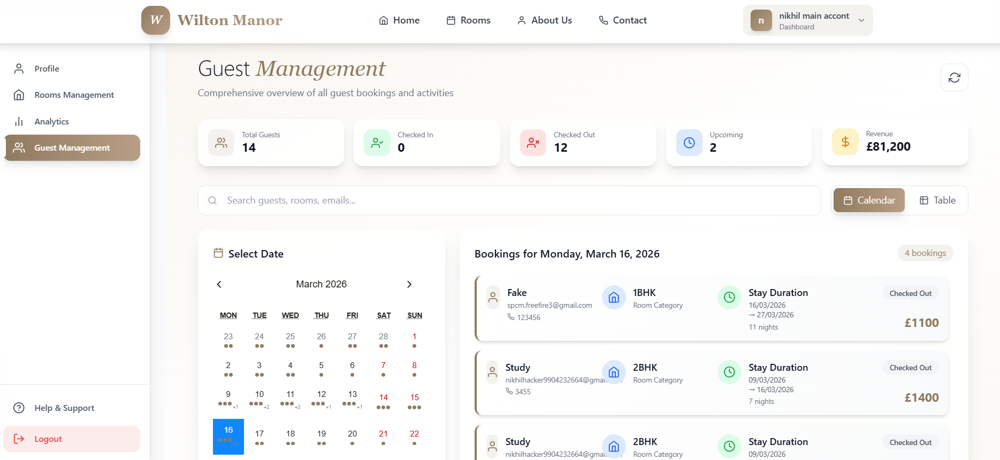

https://hotelbooking-murex-one.vercel.app/

📌 Description

A modern hotel booking web application where users can browse rooms, check availability, and make bookings.

✨ Features :- 
Browse hotel rooms, 
View room details, 
Booking functionality, 
Responsive design, 

🛠 Tech Stack :- 
Frontend, 
React.js, 
Tailwind CSS, 
Backend, 
Node.js, 
Express.js, 

Database :- 
MongoDB

👨‍💻 My Role :- 
Built frontend using React, 
Integrated APIs, 
Designed responsive UI, 
Implemented booking flow, 

🔗 Backend Repository :-
Backend is private and can be shared upon request.

## 📷 Screenshots

